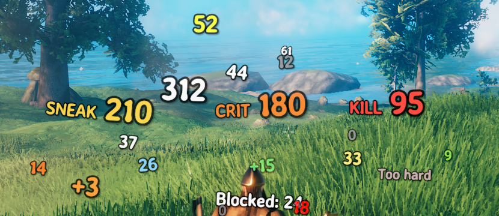

# DamageSplash

Bigger, bolder, more festive floating damage numbers for Valheim. A client-side BepInEx mod.

Valheim's damage numbers are small, thin and hard to read against snow or sand, and they all look
alike whether you grazed a greyling or landed the hit of your life. This makes them prominent,
and makes them mean something.

- **A readable face**: bold, outlined, with a pop on arrival and an arc instead of a straight
  drift. Three looks to start from, of which **Vanilla** reproduces the stock appearance exactly.
- **Size means impact**: a number is sized by the share of the target's health it took, so the
  same damage reads big on a greyling and small on a fuling berserker.
- **Sneak attacks, hits on staggered enemies and killing blows** get their own colour and a tag.
  Those first two are the only damage multipliers Valheim has, so they are its honest crits.
- **Damage over time** is tinted by element, and repeated ticks on one victim add into a single
  number that climbs and follows the creature.
- **Damage to you** has its own colour, and a heavy hit blooms red around the screen edges.
- **Multiplayer visibility**: every number, only your own fights, or none.

Nothing is shipped but the code: the fonts are the game's own and the edge vignette is generated
at runtime.

## Installing

Needs BepInEx. Drop `DamageSplash.dll` into `BepInEx/plugins`, or install the Thunderstore
package. Client-side only: the server needs nothing and players without it are unaffected.

## Configuring

Everything is a setting, and every setting takes effect on the next number with no restart.
Use ConfigurationManager in game, or the console: `splash set <name> <value>` changes one,
`splash get` prints them all.

Console commands are listed by `splash` on its own. The useful ones for judging a change are
`splash demo`, which shows one of every kind of number around you, and `splash rain`, which
trickles numbers while you drag a slider.

## Building

`./build/deploy.sh` builds Release and copies the DLL to a r2modman profile over SSH.
`./build/package.sh` assembles the Thunderstore zip in `dist/`. Reference assemblies are expected
in `lib/` (gitignored) or via `VALHEIM_INSTALL`; see `CLAUDE.md` for the details.

`PLAN.md` is the design, and the record of what the decompiled game actually does. Read it before
changing where damage is hooked or how a number is paired with the hit behind it.
